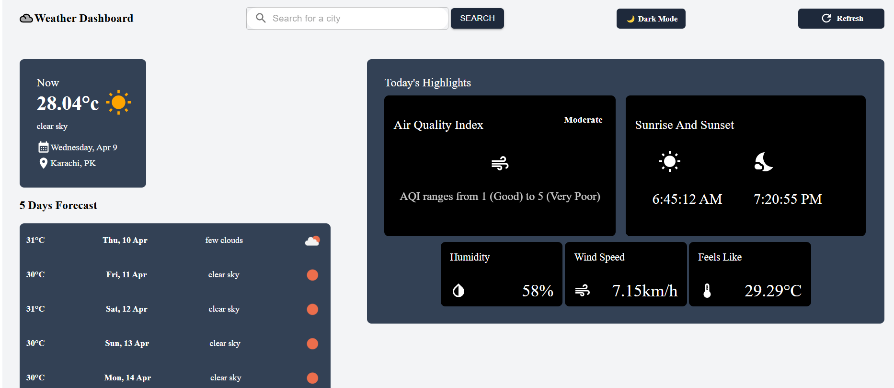
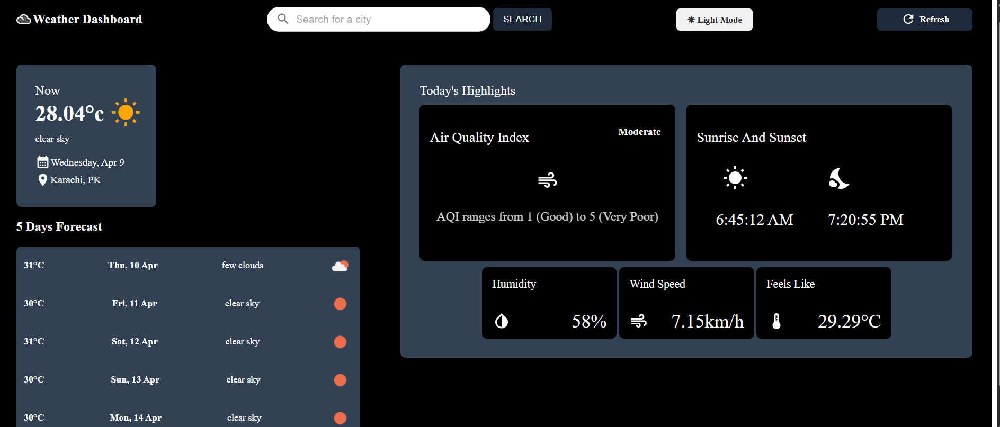

# 🌦️ Weather Dashboard App

A sleek and responsive weather dashboard that provides **real-time weather**, **air quality index**, **5-day forecast**, and more — built with **React** and powered by the **OpenWeatherMap API**.

---

## 🛠️ Tech Stack

- **React** (with Hooks)
- **Material-UI (MUI)** and custom inline styles
- **Axios** for API integration
- **OpenWeatherMap API**
- **Vite** for fast builds and development

---

## 🚀 Setup Instructions

1. **Clone the Repository**
   ```bash
   git clone https://github.com/OjasTripathi0104/weather-app.git
   cd weather-app
   ```

2. **Install Dependencies**
   ```bash
   npm install
   ```

3. **Add API Key**
   - Create a `.env` file in the root directory
   - Add your OpenWeatherMap API key:
     ```env
     VITE_API_KEY=your_openweathermap_api_key_here
     ```

4. **Run the Development Server**
   ```bash
   npm run dev
   ```

5. Open your browser and navigate to: [http://localhost:5173](http://localhost:5173)

---

## 🔗 API Integration

- Sign up at: [OpenWeatherMap API](https://openweathermap.org/api)
- Get a free API key and add it to your `.env` file
- ⚠️ **Note:** Free tier allows up to **60 API calls per minute**

---

## 🌟 Features

- 🔍 Search weather by city
- 📆 5-day forecast based on weather trends
- 🌫️ Air Quality Index (AQI)
- 🌗 Light/Dark mode toggle
- 🌅 Sunrise & 🌇 Sunset time display
- 🕵️‍♂️ Search history of last 5 cities

---

## 📸 Screenshots




---

## 📬 Feedback

Feel free to open an [issue](https://github.com/OjasTripathi0104/weather-app/issues) or create a [pull request](https://github.com/OjasTripathi0104/weather-app/pulls) for improvements.

---

